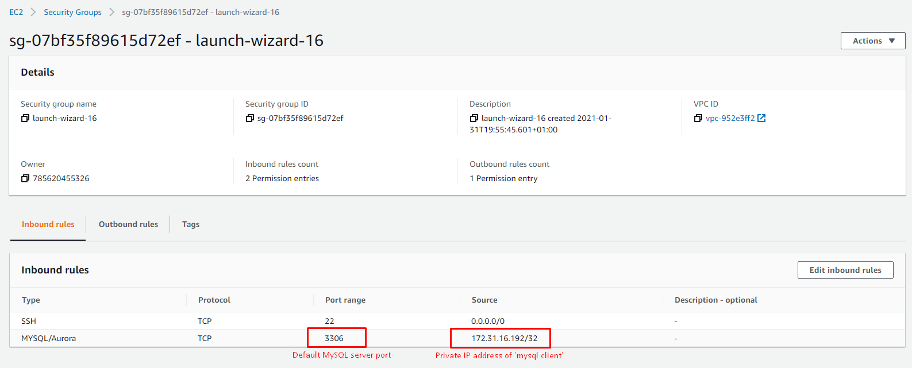
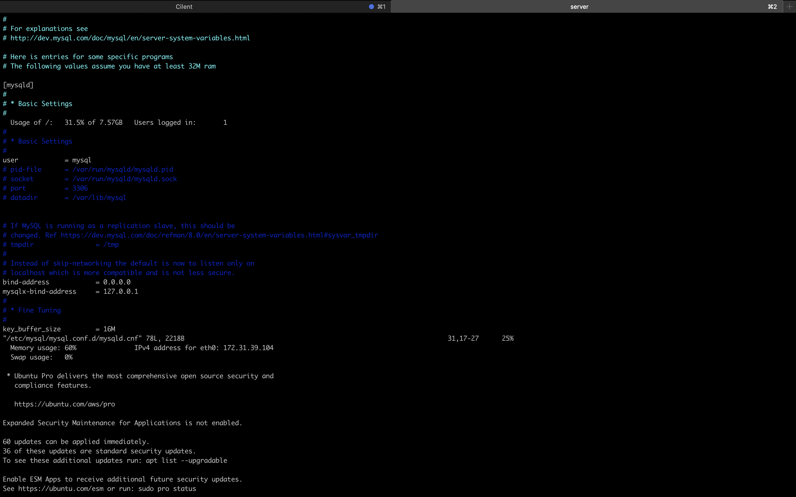
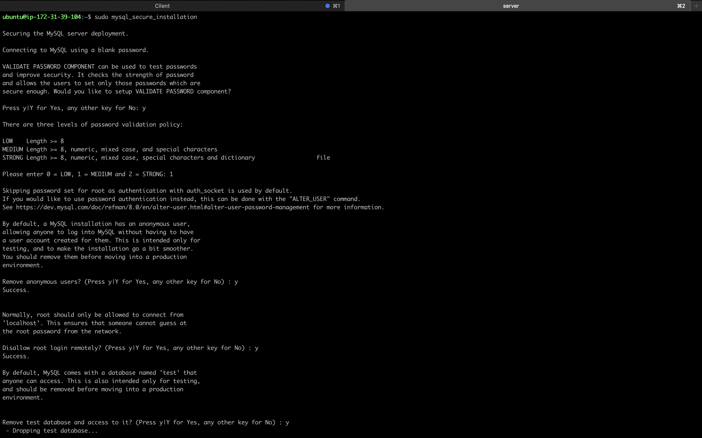
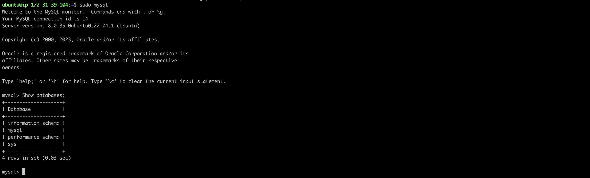

## Client-server architecture 
It is a computing model in which the server hosts, delivers and manages most of the resources and services to be consumed by the client.

## Client-Server 
It refers to an architecture in which two or more computers are connected together over a network to send and receive requests between one another.

<p>In their communication, each machine has its own role: the machine sending requests is usually referred as "Client" and the machine responding (serving) is called "Server".</p>

to see cilent-server communication can usecopy the below code.

```
$ curl -Iv www.propitixhomes.com
```


## Traceroute
A traceroute works by sending Internet Control Message Protocol (ICMP) packets, and every router involved in transferring the data gets these packets. 

# Implement a Client Server Architecture using MySQL Database Management System (DBMS).

To implement a client-server architecture will need to follow the steps below.

- Create and configure two Linux-based virtual servers (EC2 instances in AWS).
```
Server A name - `mysql server`
Server B name - `mysql client`
```
- Install mysql-client on the server
```
$ sudo apt install mysql-client
```
- Install mysql-server on the server

```
$ sudo apt install mysql-server
```

- By default, both of your EC2 virtual servers are located in the same local virtual network, so they can communicate to each other using local ip addresses. use  `mysql server`  local IP address to connect from  `mysql cilent`. MySQL server uses TCP port 3306 by default, so you will have to open it by creating a new entry in 'Inbound rules' in 'mysql server' Security Groups. For extra security, do not allow all IP addresses to reach your 'mysql server' - allow access only to the specific local IP address of your 'mysql client'.




- Configure `Mysql server` to allow connection from the remote server. `Mysql client` linux server can connect to `Mysql server` remotely without the used of ssh
```
sudo vi /etc/mysql/mysql.conf.d/mysqld.cnf 
```

replace  `127.0.0.1` to `0.0.0.0`



Configure MysQL server and create database and user

- Secure your database with `sudo mysql_secure_installation` and create a user


- Set up password with `sudo mysql -p`  
- Create a new user

- Check if successfully connected and can perform SQL queries 

