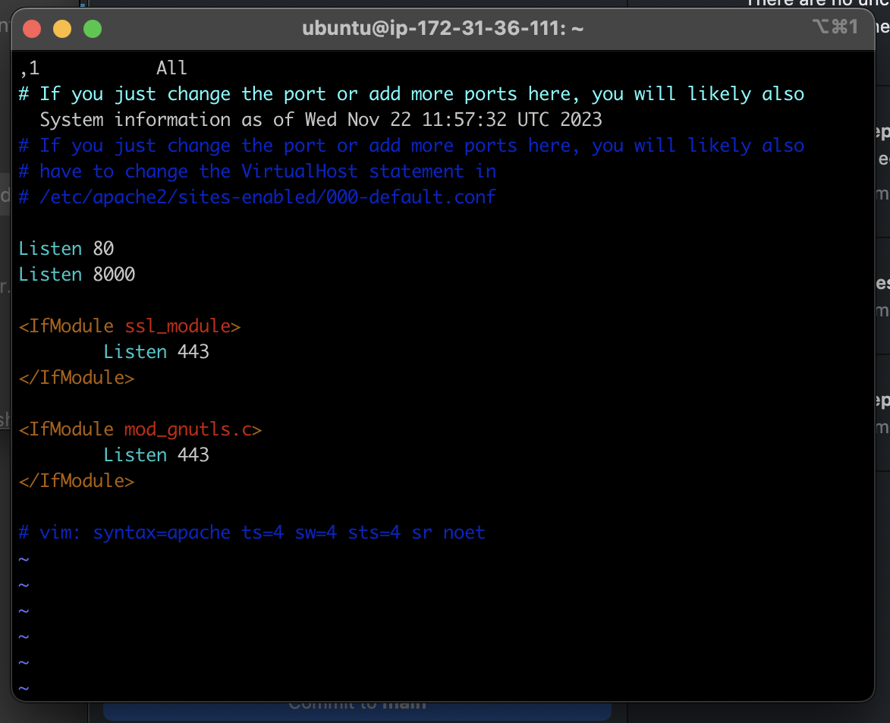
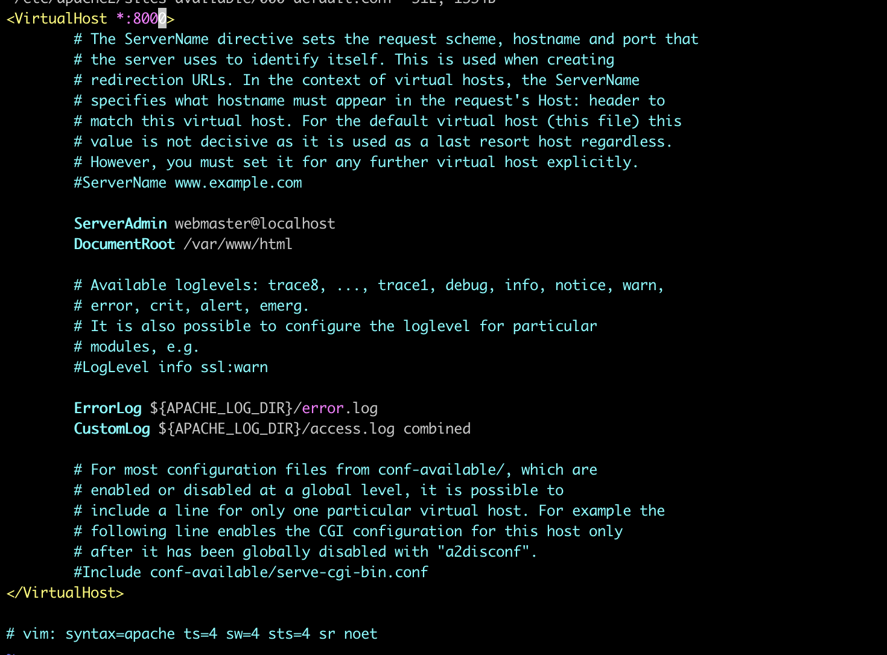
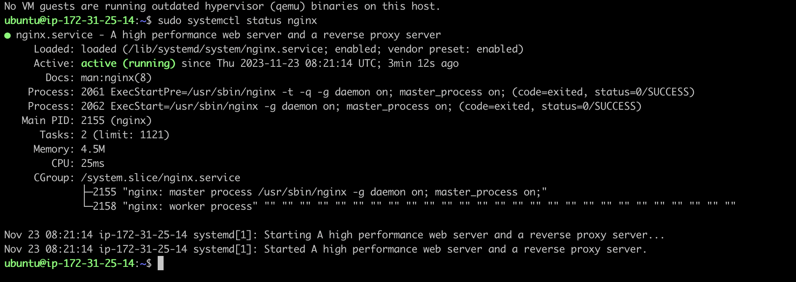

# Load Balancing:
Load balancing means distributing the work or tasks among several computers or servers so that no one computer gets overloaded with too much work. This helps to keep everything running smoothly and ensures that websites and apps work quickly and don't get too slow. It's like teamwork for computers!. 
To distribute the traffic evenly between the webservers, a load balancer is deployed. The load balancer stands in front of the webservers, all traffic gets to it first, it then distributes the traffic across the set of webservers. This is to ensure no webserver get over worked, consequently improving system performance.

## Setting Up a Basic Load Balancer

Let create two Ec2 instances running on ubuntu 22.04 and install apache web server in them.We will open port 8000 to allow traffic from anywhere, and finaly update the default page of the webservers to display their public IP address.

Next we will provision another EC2 instance running ubuntu 22.04, this time we will install Nginx and configure it to act as a load balancer distributing traffic across the webservers.

**Step 1:** Create EC2 instance. <a href=
"https://www.techtarget.com/searchcloudcomputing/tutorial/How-to-create-an-EC2-instance-from-AWS-Console">Click Here</a> to read more on how to create an Instance

**Step 2:** Open a terminal in your local, and connect to your virtual machine using ssh and .pem key Then install apache server on your instance.
```
$ sudo apt update -y &&  sudo apt install apache2 -y
```


- Verify the apache is running
```
$ sudo systemctl status apache2
```


**Step 3:** Configure Apache to server a page showing its public IP: 
we configure the Apache webserver to serve content on port 8000 instead of its default which is port 80. Then we will create a new index.html file. The file will contain code to display the public IP of the EC2 instance. We will then override apache webserver's default html file with our new file.
- Configuring Apache to Serve content on port 8000:
-- Using your text editor(eg vi, nano) open the file /etc/apache2/ports.conf
```
$ sudo vi /etc/apache2/ports.conf 
```
-- Add a new Listen directive for port 8000: First type i to switch the editor to insert mode. Then add the listen directive. Then save your file `esc` + `:wq`.



-- Next open the file /etc/apache2/sites-available/000-default.conf and change port 80 on the virtualhost to 8000 like the screenshot below:

```
$ sudo vi /etc/apache2/sites-available/000-default.conf
```


-- Restart apache to load the new configuration using the command below:
```
$ sudo systemctl restart apache2
```


- Creating our new html file:
-- Open a new index.html file with command below:

```
$ sudo vi index.html
```
- Copy the html code to in to the `vi` editor after changing it to insert mode by pressing `i`:
```
    <!DOCTYPE html>
    <html>
    <head>
        <title>My EC2 Instance</title>
    </head>
    <body>
        <h1>Welcome to my EC2 instance</h1>
        <p>Public IP: YOUR_PUBLIC_IP</p>
    </body>
    </html>

```

- Change file ownership of the index.html file with the command below:
```
$ sudo chown www-data:www-data ./index.html
```
- Overriding the Default html file of Apache Webserver:
-- Replace the default html file with our new html file using the command below:
```
$ sudo cp -f ./index.html /var/www/html/index.html
```
-- Restart the webserver to load the new configuration using the command below:
```
$ sudo systemctl restart apache2
```


**Step 4:**  Configuring Nginx as a Load Balancer
- Provision a new EC2 instance running ubuntu 22.04. Make sure port 80 is opened to accept traffic from anywhere. Your can refer to step 1 through step 2 to refresh your memory

- Install Nginx into the instance using the command below:
```
$ sudo apt update -y && sudo apt install nginx -y
```
- Verify that Nginx is installed with the command below:
```
$ sudo systemctl status nginx
```


- Open Nginx configuration file with the command below:
```
$ sudo vi /etc/nginx/conf.d/loadbalancer.conf
```
- Paste the configuration file below  to configure nginx to act like a load balancer. A screenshot of an example config file is shown below: Make sure you edit the file and provide necessary information like your server IP address etc.

```
        
        upstream backend_servers {

            # your are to replace the public IP and Port to that of your webservers
            server 127.0.0.1:8000; # public IP and port for webserser 1
            server 127.0.0.1:8000; # public IP and port for webserver 2

        }

        server {
            listen 80;
            server_name <your load balancer's public IP addres>; # provide your load balancers public IP address

            location / {
                proxy_pass http://backend_servers;
                proxy_set_header Host $host;
                proxy_set_header X-Real-IP $remote_addr;
                proxy_set_header X-Forwarded-For $proxy_add_x_forwarded_for;
            }
        }
    
```

<p><strong>upstream backend_servers</strong> defines a group of backend servers.
The <strong>server</strong> lines inside the <strong>upstream</strong> block list the addresses and ports of your backend servers.
<strong>proxy_pass</strong> inside the <strong>location</strong> block sets up the load balancing, passing the requests to the backend servers.
The <strong>proxy_set_header</strong> lines pass necessary headers to the backend servers to correctly handle the requests</p>

- Test your configuration with the command below:
```
$ sudo nginx -t
```


- If there are no errors, restart Nginx to laod the new configuration with the command below:
```
$ sudo systemctl restart nginx
```

<div class="my-5" id="page3"><h1 class="fw-bold">Load Balancing Algorithms</h1><h2>Load Balancing Algorithms</h2>
<p>Load balancer algorithms are techniques used to distribute incoming network traffic or workload across multiple servers, ensuring efficient utilization of resources and improving overall system performance, reliability, and availability. Here are some common load balancer algorithms:</p>
<ol>
<li>
<p><strong>Round Robin:</strong> This algorithm distributes requests sequentially to each server in the pool. It is simple to implement and ensures an even distribution of traffic. It works well when all servers have similar capabilities and resources.</p>
</li>
<li>
<p><strong>Least Connections:</strong> This algorithm routes new requests to the server with the least number of active connections. It is effective when servers have varying capacities or workloads, as it helps distribute traffic to the least busy server.</p>
</li>
<li>
<p><strong>Weighted Round Robin:</strong> Similar to the Round Robin algorithm, but servers are assigned different weights based on their capabilities. Servers with higher capacities receive more requests. This approach is useful when servers have varying capacities or performance levels.</p>
</li>
<li>
<p><strong>Weighted Least Connections:</strong> Similar to the Least Connections algorithm, but servers are assigned different weights based on their capabilities. Servers with higher capacities receive more connections. This approach balances traffic based on server capacities.</p>
</li>
<li>
<p><strong>IP Hash:</strong> This algorithm uses a hash function based on the client's IP address to consistently map the client to a specific server. This ensures that the same client always reaches the same server, which can be helpful for maintaining session data or stateful connections.</p>
</li>
</ol></div>

<div class="my-5" id="page4"><h1 class="fw-bold">SSL Termination and HTTPS Load Balancing</h1><h2>SSL Termination and HTTPS Load Balancing</h2>
<p>In this module we will be configuring TLS/SSL on our deployed website. But before doing so, let us take a brief moment to understand the purpose of TLS certificate, how they work and the technology behinde it.</p>
<h3>Encryption</h3>
<p>Encryption is at the heart of TLS/SSL. Encryption  is the process of converting plain, readable data (referred to as plaintext) into an unreadable format called ciphertext. The purpose of encryption is to ensure data confidentiality and protect sensitive information from unauthorized access or interception.</p>
<p>In encryption, an algorithm (known as a cryptographic algorithm) and a secret key are used to transform the plaintext into ciphertext. Only those who possess the correct key can decrypt the ciphertext and convert it back into its original plaintext form.</p>
<h3>Types of Encryption</h3>
<p>Encryption can be classified into several types based on various criteria, such as the encryption process, the key used, and the level of security provided. Here are some common types of encryption:</p>
<h4>1. Symmetric Encryption</h4>
<p>Symmetric encryption, the same key is used for both encryption and decryption processes. Both the sender and the receiver must possess the shared secret key. While symmetric encryption is generally faster than other methods, distributing and managing the secret key securely among all parties can be challenging. Examples of symmetric encryption algorithms include Advanced Encryption Standard (AES) and Data Encryption Standard (DES)</p>
<h4>2. Asymmetric Encryption</h4>
<p>Asymmetric Encryption (Public-Key Encryption): Asymmetric encryption uses two distinct keys, a public key and a private key. The public key is used for encryption, while the private key is used for decryption. Anyone can use the recipient's public key to encrypt data, but only the recipient with the matching private key can decrypt and read the data. This method eliminates the need for secure key distribution but is computationally more intensive than symmetric encryption. Popular asymmetric encryption algorithms include RSA (Rivest-Shamir-Adleman) and Elliptic Curve Cryptography (ECC).</p>
<h4>3. Hybrid Encryption</h4>
<p>Hybrid encryption combines both symmetric and asymmetric encryption. In this approach, the sender generates a random symmetric key for each message and encrypts the actual data using this symmetric key (which is efficient for large amounts of data). Then, the sender encrypts the symmetric key using the recipient's public key and sends both the encrypted data and the encrypted symmetric key to the recipient. The recipient can decrypt the symmetric key using their private key and then use the symmetric key to decrypt the actual data. This method leverages the advantages of both symmetric and asymmetric encryption.</p>
<h3>The Purpose of TLS/SSL Certificate</h3>
<p>The main purpose of TLS/SSL certificates is to encrypt the data transmitted between the web server and the client. This ensures that sensitive information, such as login credentials, personal data, or credit card details, remains confidential and protected from eavesdropping.</p>
<p>A secondary benefit is to establish trust between webservers and their client. Before data is transmitted between client and sever, the server needs to go through the process of authentication(server proves that its identity is genuine) by presenting its certificate to the cleint which is validate by a trusted Certificate Authority CA.</p>
<p>There are terms such as CA, certificate that you may not understand at the moment. But not to worry, all these will be explained in the next section.</p>
<h3>How TLS/SSL Work</h3>
<p>TLS/SSL works with hybrid encryption. This means that both symmetric and Asymmetric encryption is used in TLS/SSL.</p>
<p>Before data is transmitted between client and server, the process of <strong>TLS Handshake</strong> is carried out.</p>
<p>During TLS handshake, the server shares with the client its digital certificate. The digital certificate contains the public key of the server.</p>
<p>The client(browser) verifies the validity of the servers public key using the public key of the <strong>Certificate Authority</strong> CA. If valid, the client encrypts it encryption key using the server's public key. This encrypted key is then sent to the server.</p>
<p>The client generates its encryption key using symmetric encryption. The implication is that its uses the same key for both encryption and decryption hence the need to encrypt its key using the server public key.</p>
<p>Since the server is the only entity in possession of its private key, It is able to decrypt the clients encrypted key.</p>
<p>After the handshake process is completed, the client encrypts every data it sends to the server. The server is then able to decrypt the data with the client's encryption key.</p>
<p>This ensures that only the server is able to make sense of the data shared by the client.</p></div>


<div class="my-5" id="page5"><h1 class="fw-bold">Advanced Load Balancing Features</h1><h2>Advanced Load Balancing Features</h2>
<p>Advanced features of load balancing enhance the capabilities and efficiency of load balancers in handling complex scenarios and optimizing application performance. Here are some key advanced features:</p>
<ol>
<li>
<p><strong>SSL Offloading/Termination:</strong> Load balancers can handle Secure Socket Layer (SSL) encryption and decryption on behalf of backend servers. This offloading reduces the computational burden on application servers, enabling them to focus on processing application logic instead of handling SSL/TLS encryption.</p>
</li>
<li>
<p><strong>Session Persistence/Sticky Sessions:</strong> Some applications require that a client's requests consistently go to the same backend server to maintain session state. Load balancers can use techniques like cookie-based or IP-based persistence to ensure requests from a specific client are directed to the same server throughout the session.</p>
</li>
<li>
<p><strong>Health Checks and Automatic Server Failover:</strong> Load balancers can perform periodic health checks on backend servers to monitor their availability and performance. If a server becomes unresponsive or unhealthy, the load balancer can automatically remove it from the server pool, rerouting traffic to healthy servers, thus ensuring high availability.</p>
</li>
<li>
<p><strong>Global Server Load Balancing (GSLB):</strong> GSLB enables load balancing across multiple data centers or geographically distributed server clusters. It helps direct traffic to the nearest or most available data center, optimizing user experience and providing disaster recovery capabilities.</p>
</li>
<li>
<p><strong>Application-Layer Load Balancing:</strong> Advanced load balancers can make routing decisions based on application-specific attributes beyond traditional IP and TCP/UDP information. For example, they can inspect HTTP headers or application-layer protocols to direct traffic based on content, URL, or user agent.</p>
</li>
<li>
<p><strong>Dynamic Load Balancing:</strong> Some load balancers use real-time analytics and machine learning to dynamically adjust server weights or routing decisions based on current server performance, network conditions, and application demands. This adaptability ensures efficient resource utilization.</p>
</li>
<li>
<p><strong>Anycast Load Balancing:</strong> Anycast allows multiple load balancer instances to share the same IP address across different locations. When a client sends a request, it is automatically routed to the nearest load balancer instance, reducing latency and improving performance.</p>
</li>
<li>
<p><strong>Rate Limiting and Traffic Shaping:</strong> Load balancers can enforce rate limits on incoming requests from clients, preventing denial-of-service attacks and controlling resource utilization. They can also shape traffic, prioritizing certain types of requests over others based on defined policies.</p>
</li>
<li>
<p><strong>Web Application Firewall (WAF) Integration:</strong> Some load balancers offer integrated WAF functionality to protect web applications from common security threats like SQL injection, cross-site scripting (XSS), and other vulnerabilities.</p>
</li>
</ol>
<p>These advanced features make load balancers powerful tools for optimizing application performance, ensuring high availability, and protecting applications from various threats and failures. They are essential components in modern, scalable, and robust IT infrastructures.</p></div>