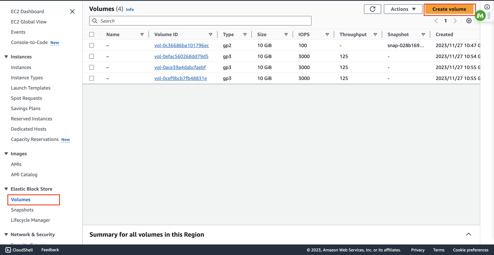
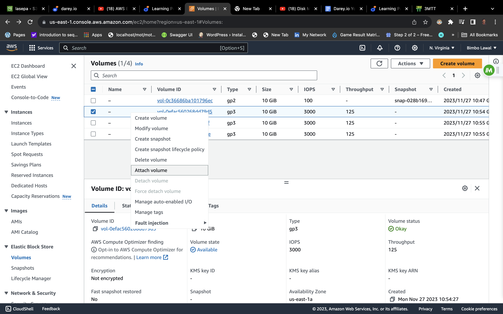
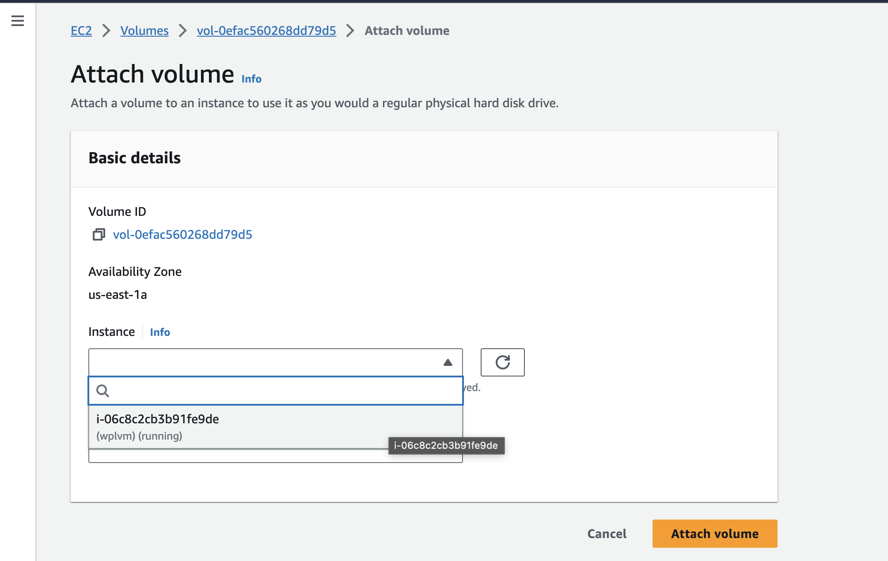
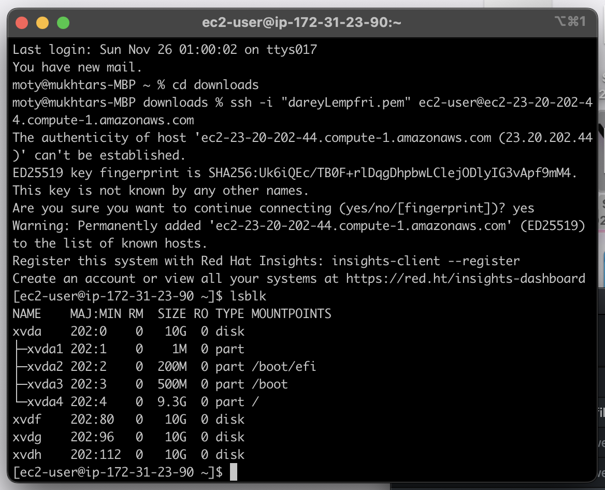
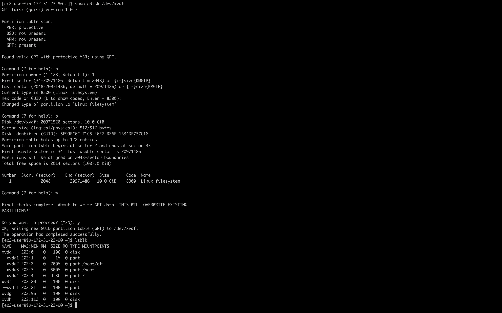
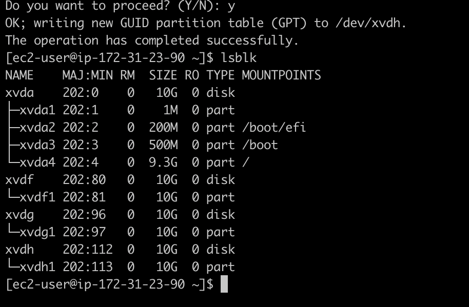
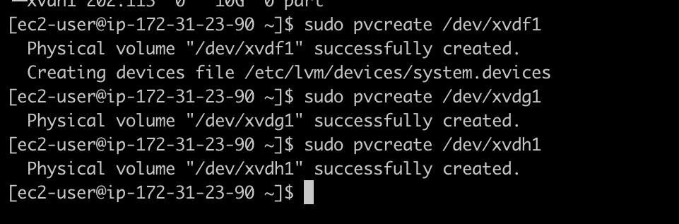
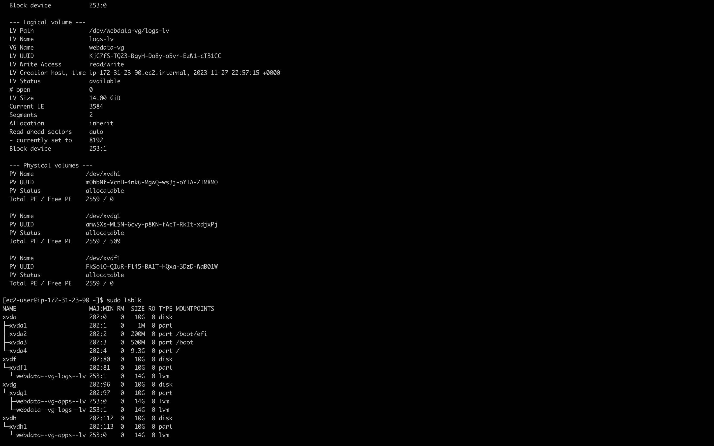
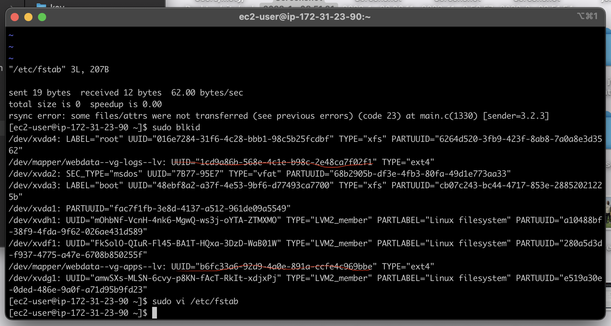

## Implementing Wordpress website with LVM Storage management

In this project we will be work on storage infrastructure on two Linux servers and implement a basic web solution using wordpress.
**WordPress** is a free and open-source content management system written in PHP and paired with MYSQL OR MariaDB as its backend Relational Database Management System (RDBMS).

This project divided into two parts:
- Configure storage subsystem for Web and Database servers based on Linux OS. The focus of this part is to give you practical experience of working with disks, partitions and volumes in Linux.
- Install WordPress and connect it to a remote MySQL database server. This part of the project will solidify your skills of deploying Web and DB tiers of Web solution.

# Understanding 3 Tier Architecture

**3 Tier Architecture** is a client-server software architecture pattern that comprise of 3 separate layers which are **Presentation Layer**, **Business Layer**, and **Data Access or Management Layer (DAL)**. 

- **Presentation Layer (PL):** This is the user interface such as the client server or browser on your laptop.

- **Business Layer (BL)**: This is the backend program that implements business logic. Application or Webserver.

**Data Access or Management Layer (DAL):** This is the layer for computer data storage and data access. 

We ensure that the disks used to store files on the Linux servers are adequately partitioned and managed through programs such as `gdisk` and `LVM` respectively.

We will be working  with several storage and disk management concepts, to have a better understanding, watch following video: disk management in linux.

Your 3-Tier Setup
- A Laptop or PC to serve as a client
- An EC2 Linux Server as a web server (This is where you will install Wordpress)
- An EC2 Linux server as a database (DB) server

**Use `RedHat` OS for this project**

For Ubuntu server, when connecting to it via SSH/Putty or any other tool, we used `ubuntu` user, but for RedHat you will need to use `ec2-user` user. Connection string will look like `ec2-user@<Public-IP>`

## Implementing LVM on Linux servers (Web and Database servers)
**Step 1 -** Prepare a Web Server
- Launch an EC2 instance that will serve as "Web Server". Create 3 volumes in the same AZ as your Web Server EC2, each of 10 GiB.



- Attach all three volumes one by one to your Web Server EC2 instance




- Open up the Linux terminal to begin configuration
- Use <a href="https://man7.org/linux/man-pages/man8/lsblk.8.html">`lsblk`</a> command to inspect what block devices are attached to the server. Notice names of your newly created devices. All devices in Linux reside in /dev/ directory. Inspect it with `ls /dev/` and make sure you see all 3 newly created block devices there - their names will likely be `xvdf`, `xvdh`, `xvdg`.



- Use <a href="https://en.wikipedia.org/wiki/Df_(Unix)">`df -h`</a> command to see all mounts and free space on your server
- Use `gdisk` utility to create a single partition on each of the 3 disks
```
$ sudo gdisk /dev/xvdf
```


- Use `lsblk` utility to view the newly configured partition on each of the 3 disks.



- Install <a href="https://en.wikipedia.org/wiki/Logical_Volume_Manager_(Linux)">`lvm2`</a> package using `sudo yum install lvm2`. Run `sudo lvmdiskscan` command to check for available partitions.

**Note:** Previously, in Ubuntu we used `apt` command to install packages, in RedHat/CentOS a different package manager is used, so we shall use `yum` command instead.

- Use <a href="https://linux.die.net/man/8/pvcreate">`pvcreate`</a> utility to mark each of 3 disks as physical volumes (PVs) to be used by LVM

```
sudo pvcreate /dev/xvdf1
sudo pvcreate /dev/xvdg1
sudo pvcreate /dev/xvdh1
```


- Use <a href="https://linux.die.net/man/8/vgcreate">`vgcreate`</a> utility to add all 3 PVs to a volume group (VG). Name the VG <strong>webdata-vg</strong>

```
$ sudo vgcreate webdata-vg /dev/xvdh1 /dev/xvdg1 /dev/xvdf1
```
- Verify that your VG has been created successfully by running `sudo vgs`

- Use <a href="https://linux.die.net/man/8/lvcreate">`lvcreate`</a> utility to create 2 logical volumes.  <strong>apps-lv</strong> (<em><strong>Use half of the PV size</strong></em>), and <strong>logs-lv</strong> <em><strong>Use the remaining space of the PV size</strong></em>. <strong>NOTE</strong>: apps-lv will be used to store data for the Website while, logs-lv will be used to store data for logs.

```
sudo lvcreate -n apps-lv -L 14G webdata-vg
sudo lvcreate -n logs-lv -L 14G webdata-vg
```
- Verify the entire setup

```
sudo vgdisplay -v #view complete setup - VG, PV, and LV
sudo lsblk 
```



<li>Use < node="[object Object]">mkfs.ext4</> to format the logical volumes with <a href="https://en.wikipedia.org/wiki/Ext4">ext4</a> filesystem</li>
```
sudo mkfs -t ext4 /dev/webdata-vg/apps-lv
sudo mkfs -t ext4 /dev/webdata-vg/logs-lv
```

- Create <strong>/var/www/html</strong> directory to store website files
```
$ sudo mkdir -p /var/www/html
```

- Create <strong>/home/recovery/logs</strong> to store backup of log data</p>
```
$ sudo mkdir -p /home/recovery/logs
```
- Mount <strong>/var/www/html</strong> on <strong>apps-lv</strong> logical volume
```
$ sudo mount /dev/webdata-vg/apps-lv /var/www/html/
```
- Use <a href="https://linux.die.net/man/1/rsync">`rsync`</a> utility to backup all the files in the log directory <strong>/var/log</strong> into <strong>/home/recovery/logs</strong> (<em>This is required before mounting the file system</em>)
```
$ sudo rsync -av /var/log/. /home/recovery/logs/
```
- Restore log files back into  **/var/log** directory
```
$ sudo rsync -av /home/recovery/logs/log/. /var/log
```

- Update `/etc/fstab` file so that the mount configuration will persist after restart of the server.

The UUID of the  device will be used to update the `/etc/fstab` file

```
$ sudo blkid
```


```
$ sudo vi /etc/fstab
```

- Update `/etc/fstab` in this format using your own UUID and rememeber to remove the leading and ending quotes.
- Test the configuration and reload the daemon
```
$ sudo mount -a
$ sudo systemctl daemon-reload
```
- Verify your setup by running `df -h`, output must look like this:
